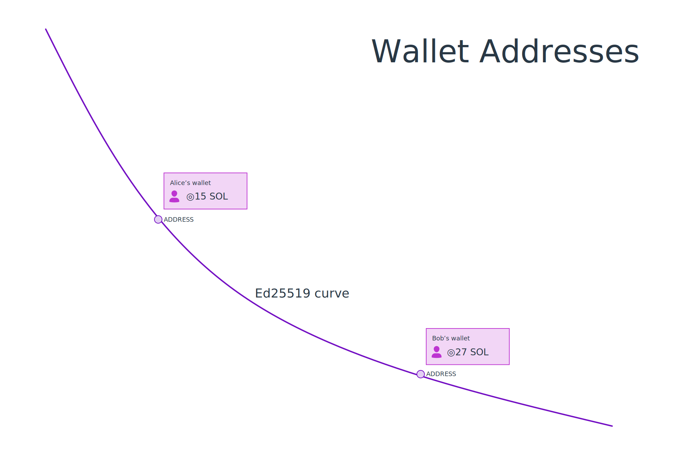

## TL;DR

- 密钥对是一对匹配的公钥和秘密密钥。
- 公钥用作指向 Solana 网络上帐户的“地址”。公钥可以与任何人共享。
- 密钥用于验证帐户的权限。顾名思义，您应该始终对密钥保密。
- @solana/web3.js 提供了用于创建全新密钥对或使用现有密钥构建密钥对的辅助函数。

## 概述

### 对称和非对称密码学

“密码学”字面意思是隐藏信息的研究。您每天会遇到两种主要类型的密码学：

对称密码术是使用相同的密钥来加密和解密。它已有数百年历史，从古埃及人到伊丽莎白一世女王，每个人都在使用它。

对称加密算法有多种，但今天最常见的是 AES 和 Chacha20。


#### 非对称密码学

- 非对称加密技术 - 也称为“[公钥加密技术](https://en.wikipedia.org/wiki/Public-key_cryptography)”，于 20 世纪 70 年代开发。在非对称加密中，参与者拥有密钥对（或密钥对）。每个密钥对由一个秘密密钥和一个公钥组成。非对称加密的工作原理与对称加密不同，并且可以做不同的事情
- 加密：如果使用公钥加密，则只能使用同一密钥对中的秘密密钥来读取它
- 签名：如果使用密钥加密，则可以使用同一密钥对中的公钥来证明密钥的持有者对其进行了签名。
- 您甚至可以使用非对称加密技术来计算出用于对称加密技术的好密钥！这称为密钥交换，您使用自己的公钥和接收者的公钥来生成“会话”密钥。
- 对称加密算法有多种，但今天最常见的是 ECC 或 RSA 的变体。

非对称加密非常流行：

- 您的银行卡内有一个密钥，用于签署交易。
- 您的银行可以通过使用匹配的公钥进行检查来确认您是否进行了交易。
- 网站在其证书中包含公钥，您的浏览器将使用此公钥来加密发送到网页的数据（例如个人信息、登录详细信息和信用卡号）。 网站有匹配的私钥，因此网站可以读取数据。
- 您的电子护照由签发国家签署，以确保护照不被伪造。电子护照门可以使用您的签发国的公钥来确认这一点。
- 手机上的消息应用程序使用密钥交换来创建会话密钥。

简而言之，密码学就在我们身边。 Solana 以及其他区块链只是密码学的一种用途。

### Solana 使用公钥作为地址



参与 Solana 网络的人至少拥有一对密钥。在索拉纳：

- 公钥用作指向 Solana 网络上帐户的“地址”。即使是友好的名称 - 例如 `example.sol` - 也指向 `dDCQNnDmNbFVi8cQhKAgXhyhXeJ625tvwsunRyRc7c8` 这样的地址
- 私钥用于验证该密钥对的权限。如果您拥有某个地址的密钥，您就可以控制该地址内的代币。因此，顾名思义，您应该始终对密钥保密。


### 使用 `@solana/web3.js` 制作密钥对

您可以通过浏览器或带有 `@solana/web3.js` npm 模块的 Node.js 使用 Solana 区块链。按照平常的方式设置一个项目，然后[使用 npm](https://nodesource.com/blog/an-absolute-beginners-guide-to-using-npm/) 安装 `@solana/web3.js`

```bash
npm i @solana/web3.js
```

我们将在本课程中逐步介绍许多 [web3.js](https://docs.solana.com/developing/clients/javascript-reference) 的内容，但您也可以查看[官方 web3.js 文档](https://docs.solana.com/developing/clients/javascript-reference)。

要发送令牌、发送 NFTS 或读取和写入数据 Solana，您需要自己的密钥对。要创建新的密钥对，请使用 `@solana/web3.js` 中的 `Keypair.generate()` 函数：


```js
import { Keypair } from "@solana/web3.js";

const keypair = Keypair.generate();

console.log(`The public key is: `, keypair.publicKey.toBase58());
console.log(`The secret key is: `, keypair.secretKey);
```

### ⚠️ 不要在源代码中包含密钥

由于密钥对可以从密钥重新生成，因此我们通常只存储密钥，并从密钥恢复密钥对。

此外，由于密钥赋予了地址权限，因此我们不会将密钥存储在源代码中。相反，我们：

- 将密钥放入 `.env` 文件中
- 将 `.env` 添加到 `.gitignore`，这样 `.env` 文件就不会被提交。

### 加载现有密钥对

如果您已经有想要使用的密钥对，则可以从文件系统或 `.env` 文件中存储的现有密钥加载密钥对。在node.js中，`@solana-developers/node-helpers` npm包包含一些额外的功能：

- 要使用 `.env` 文件，请使用 `getKeypairFromEnvironment()`
- 要使用 `Solana CLI` 文件，请使用 `getKeypairFromFile()``

```js
import * as dotenv from "dotenv";
import { getKeypairFromEnvironment } from "@solana-developers/node-helpers";

dotenv.config();

const keypair = getKeypairFromEnvironment("SECRET_KEY");
```

您知道如何制作和加载密钥对！让我们练习一下我们所学的内容。

## 演示

### 安装

创建一个新目录，安装 `TypeScript`、`Solana web3.js` 和 `esrun`：

```bash
mkdir generate-keypair
cd generate-keypair
npm init -y
npm install typescript @solana/web3.js @digitak/esrun @solana-developers/node-helpers
```

创建一个名为`generate-keypair.ts`的新文件

```bash
import { Keypair } from "@solana/web3.js";
const keypair = Keypair.generate();
console.log(`✅ Generated keypair!`)
```

运行 `npx esrungenerate-keypair.ts`。您应该看到文本：

```bash
✅ Generated keypair!
```

每个密钥对都有一个 `publicKey` 和 `SecretKey` 属性。更新文件：

```bash
import { Keypair } from "@solana/web3.js";

const keypair = Keypair.generate();

console.log(`The public key is: `, keypair.publicKey.toBase58());
console.log(`The secret key is: `, keypair.secretKey);
console.log(`✅ Finished!`);
```

运行 `npx esrungenerate-keypair.ts`。您应该看到文本：

```bash
The public key is:  764CksEAZvm7C1mg2uFmpeFvifxwgjqxj2bH6Ps7La4F
The secret key is:  Uint8Array(64) [
  (a long series of numbers)
]
✅ Finished!
```

### 从 `.env` 文件加载现有密钥对


为了确保您的密钥安全，我们建议使用 `.env` 文件注入密钥：

使用您之前创建的密钥的内容创建一个名为 `.env` 的新文件：

```bash
SECRET_KEY="[(a series of numbers)]"
```

然后我们可以从环境中加载密钥对。更新`generate-keypair.ts`：

```js
import * as dotenv from "dotenv";
import { getKeypairFromEnvironment } from "@solana-developers/node-helpers";

dotenv.config();

const keypair = getKeypairFromEnvironment("SECRET_KEY");

console.log(
  `✅ Finished! We've loaded our secret key securely, using an env file!`
);
```

运行 `npx esrungenerate-keypair.ts`。您应该看到以下结果：


```bash
✅ Finished! We've loaded our secret key securely, using an env file!
```

我们现在已经了解了密钥对，以及如何在 Solana 上安全地存储密钥。在下一章中，我们将使用它们！
